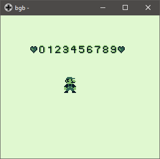

# png to gb #

Small application to convert `.png` images to the GameBoy format.

## Preview ##

This spritesheet will be given to the application (32x32 containing 16 sprites each 8x8):

![spritesheet][3]

```bash
>png_to_gb.exe "test.png"
```

And will output following string:

```C
test_0: db $38, $00, $7c, $38, $66, $44, $66, $44, $66, $44, $66, $44, $66, $44, $3c, $38
test_1: db $08, $00, $3c, $08, $3c, $38, $0c, $08, $0c, $08, $0c, $08, $0c, $08, $0c, $08
test_2: db $38, $00, $7c, $38, $46, $44, $0e, $04, $1c, $08, $38, $10, $7c, $20, $7e, $7c
test_3: db $38, $00, $7c, $38, $4e, $44, $3e, $04, $3e, $38, $4e, $04, $7e, $44, $3c, $38
test_4: db $18, $00, $3c, $18, $7c, $28, $7c, $48, $7e, $7c, $0c, $08, $0c, $08, $0c, $08
test_5: db $7c, $00, $7e, $7c, $78, $40, $7c, $78, $06, $04, $46, $04, $7e, $44, $3c, $38
test_6: db $38, $00, $7c, $38, $66, $44, $78, $40, $7c, $78, $66, $44, $7e, $44, $3c, $38
test_7: db $7c, $00, $fe, $7c, $0e, $04, $1c, $08, $18, $10, $18, $10, $18, $10, $18, $10
test_8: db $38, $00, $7c, $38, $66, $44, $7e, $44, $3c, $38, $66, $44, $7e, $44, $3c, $38
test_9: db $38, $00, $7c, $38, $66, $44, $7e, $44, $3e, $3c, $46, $04, $7e, $44, $3c, $38
test_10: db $00, $00, $6c, $6c, $92, $fe, $c2, $be, $a2, $de, $44, $7c, $28, $38, $10, $10
test_11: db $00, $07, $00, $0f, $0f, $0e, $1f, $14, $1f, $16, $0f, $08, $07, $00, $0d, $0f
test_12: db $00, $c0, $00, $f8, $e0, $40, $f8, $40, $fc, $20, $f8, $78, $e0, $00, $b0, $f0
test_13: db $1d, $1f, $3c, $3f, $3a, $0d, $38, $07, $30, $0f, $00, $0e, $1c, $1c, $3c, $3c
test_14: db $b8, $f8, $3c, $fc, $5c, $b0, $1c, $e0, $0c, $f0, $00, $70, $38, $38, $3c, $3c
test_15: db $00, $00, $20, $30, $38, $30, $10, $38, $38, $18, $08, $18, $00, $00, $08, $18
test_end:
```

This can be copied into your rom. Example rom using this spritesheet:



You can also cut them into 8x16 sprites with the `-m` option:

```bash
>png_to_gb.exe "test.png" -m
```

## Notes ##

This application forces you to use the 4 shades of green for your images:

![green][2]

- White       = #9bbc0f
- LightGray   = #8bac0f
- DarkGray    = #306230
- Black       = #0f380f

## License ##

This software is licensed under the MIT License. See [LICENSE][1] for more information.

[1]:LICENSE
[2]:resources/green.png
[3]:resources/test.png
